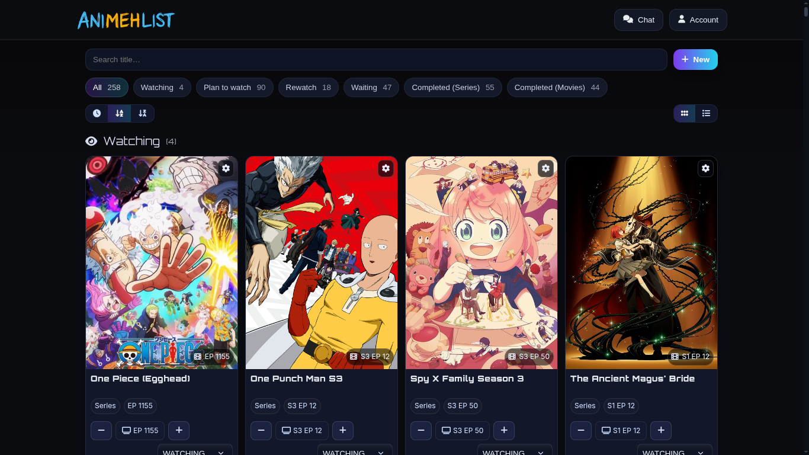
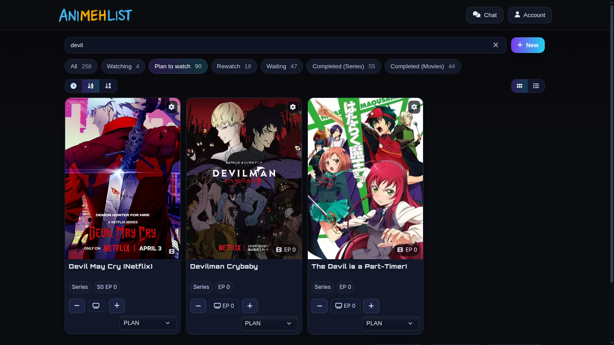
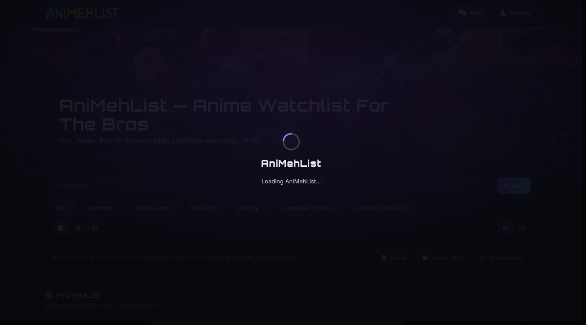
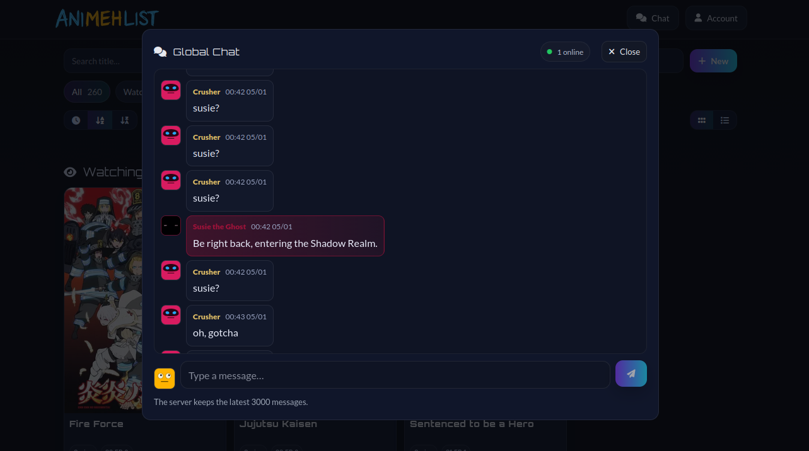
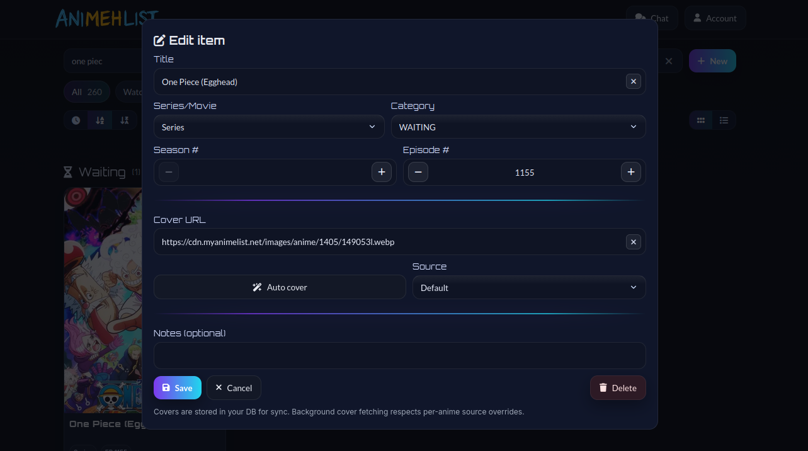
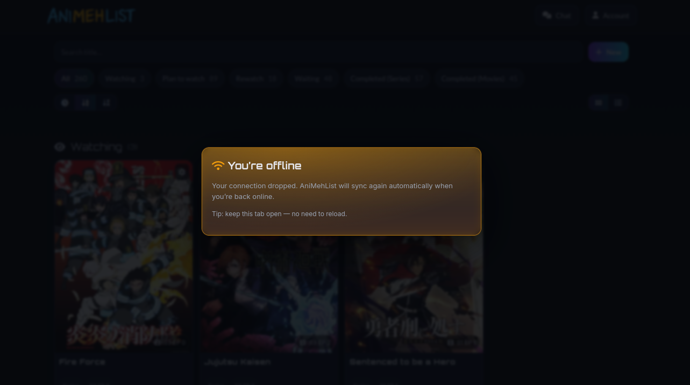

<!-- Title -->
 

  

  Track, organize, and rate your anime with a clean, simple interface. Inspired by MAL and Anilist—built for the bros ;) 

 

<!-- Screenshots -->

  
  
  
  
  
  

---

  <h1>Website</h1>

  

  
Check it out (beta):

  

